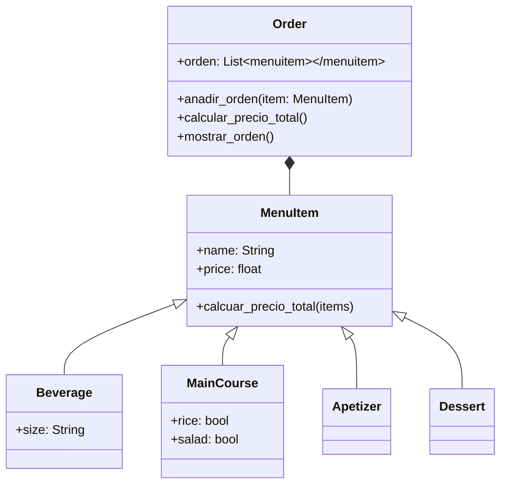

# Reto_3POO
>1.Ejercicio de clase

```python
import math
class Point:
  definition: str = "Entidad geometrica abstracta que representa una ubicación en un espacio."
  def __init__(self, x: float=0, y: float=0):
    self.x = x
    self.y = y
  def move(self, new_x: float, new_y: float):
    self.x = new_x
    self.y = new_y
  def reset(self):
    self.x = 0
    self.y = 0

class Line:
    def __init__(self, longitud:float, pendiente: float, punto_inicio:Point, punto_final:Point):
        self.longitud= longitud
        self.pendiente = pendiente
        self.punto_inicio = punto_inicio
        self.punto_final = punto_final
    #Metodos de la clase Line
    def calcular_longitud(self):
       distancia = math.sqrt((self.punto_final.x - self.punto_inicio.x)**2 + (self.punto_final.y - self.punto_inicio.y)**2) 
       return distancia
    def calcular_pendiente(self):
       opuesto = self.punto_final.y - self.punto_inicio.y
       adjacente = self.punto_final.x - self.punto_inicio.x
       angulo = (180/math.pi)*(math.atan(opuesto / adjacente))
       #Calculamos el angulo en grados
       if opuesto > 0 and adjacente > 0:
          return angulo
       if opuesto > 0 and adjacente < 0:
          return 180 - angulo
       if opuesto < 0 and adjacente < 0:
          return 180 + angulo
       if opuesto < 0 and adjacente > 0:
          return 360 - angulo
    #Verificamos si la linea cruza el eje horizontal o vertical
    #Para el eje horizontal verificamos si la coordenada y de los puntos inicial y final son iguales a 0 o si una es menor que 0 y la otra mayor que 0
    def calcular_cruce_horizontal(self):
       if self.punto_inicio.y == 0 or self.punto_final.y == 0:
          return True
       elif self.punto_inicio.y < 0 and self.punto_final.y > 0:
          return True
       elif self.punto_inicio.y > 0 and self.punto_final.y < 0:
          return True
       else :
          return False
    #Para el eje vertical verificamos si la coordenada x de los puntos inicial y final son iguales a 0 o si una es menor que 0 y la otra mayor que 0
    def calcular_cruce_vertical(self):
       if self.punto_inicio.x == 0 or self.punto_final.x == 0:
          return True
       elif self.punto_inicio.x < 0 and self.punto_final.x > 0:
          return True
       elif self.punto_inicio.x > 0 and self.punto_final.x < 0:
          return True
       else :
          return False
class Rectangule:
    def __init__(self, linea1:Line, linea2:Line, linea3:Line, linea4:Line):
        self.linea1 = linea1
        self.linea2 = linea2
    def crear_rectangulo(self):
        esquina1 = self.linea1.punto_inicio
        esquina2 = self.linea1.punto_final
        esquina3 = Point(self.linea2.punto_inicio.x, self.linea1.punto_final.y)
        esquina4 = Point(self.linea2.punto_final.x, self.linea1.punto_inicio.y)

        self.esquinas = [esquina1, esquina2, esquina3, esquina4]

        # Creamos las otras dos líneas
        self.linea3 = Line(
            longitud=self.linea1.calcular_longitud(),
            pendiente=self.linea1.calcular_pendiente(),
            punto_inicio = esquina2,
            punto_final = esquina3
        )
        self.linea4 = Line(
            longitud = self.linea2.calcular_longitud(),
            pendiente = self.linea2.calcular_pendiente(),
            punto_inicio = esquina4,
            punto_final = esquina1
        )

        # Calculamos el punto medio del rectángulo
        self.punto_medio = Point(
            (esquina1.x + esquina3.x) / 2,
            (esquina1.y + esquina3.y) / 2
        )

        return self.esquinas, self.punto_medio
```
>2.Restaurant scenario: You want to design a program to calculate the bill for a customer's order in a restaurant.
>Define a base class MenuItem: This class should have attributes like name, price, and a method to calculate the total price.
Create subclasses for different types of menu items: Inherit from MenuItem and define properties specific to each type (e.g., Beverage, Appetizer, MainCourse).
Define an Order class: This class should have a list of MenuItem objects and methods to add items, calculate the total bill amount, and potentially apply specific discounts based on the order composition.

```python
class MenuItem:
    def __init__(self, name:str, price:float):
        self.name = name
        self.price = price
    def calcuar_precio_total(self, items):
        total = 0
        for i in items:
            Total += i.price
        return total
class Beverage(MenuItem):
    def __init__(self, name, price, size:str):
        super().__init__(name, price)
        self.size = size
        if size == "small":
            self.price = 1500
        elif size == "medium":
            self.price = 2000
        else:
            self.price = 3000
class MainCourse(MenuItem):
    def __init__(self, name , price, rice:bool, salad:bool):
        super().__init__(name, price)
        self.rice = rice
        self.salad = salad
        if rice == True:
            self.price += 2000
        if salad == True:
            self.price += 1500
class Apetizer(MenuItem):
    def __init__(self, name, price):
        super().__init__(name, price)
        self.price = price
class Dessert(MenuItem):
    def __init__(self, name, price):
        super().__init__(name, price)
        self.price = price
class Order:
    def __init__(self):
        self.orden = []
    def anadir_orden(self, item: "MenuItem"):
        self.orden.append(item)
    def calcular_precio_total(self):
        total = 0
        for i in self.orden:
            total += i.price
        return total
    def mostrar_orden(self):
        for i in self.orden:
            print(f"{i.name} - {i.price}")
        print(f"Total: {self.calcular_precio_total()}")

if __name__ == "__main__":
    order = Order()
    order.anadir_orden(Beverage("Coca-Cola", 0, "small"))
    order.anadir_orden(MainCourse("Pollo Asado", 10000, rice=True, salad=False))
    order.anadir_orden(Apetizer("Empanada", 2500))
    order.anadir_orden(Dessert("Helado", 3000))
    order.anadir_orden(MainCourse("Carne Encebollada", 12000, rice=True, salad=True))
    order.anadir_orden(Dessert("Torta de chocolate", 3500))
    order.anadir_orden(MainCourse("Pescado frito", 11000, rice=False, salad=True))
    order.anadir_orden(Apetizer("Patacón", 2000))
    order.anadir_orden(Beverage("Coca-Cola", 0, "medium"))
    order.anadir_orden(Beverage("Coca-Cola", 0, "large"))
    order.mostrar_orden()

```
Diagrama UML del restaurante

